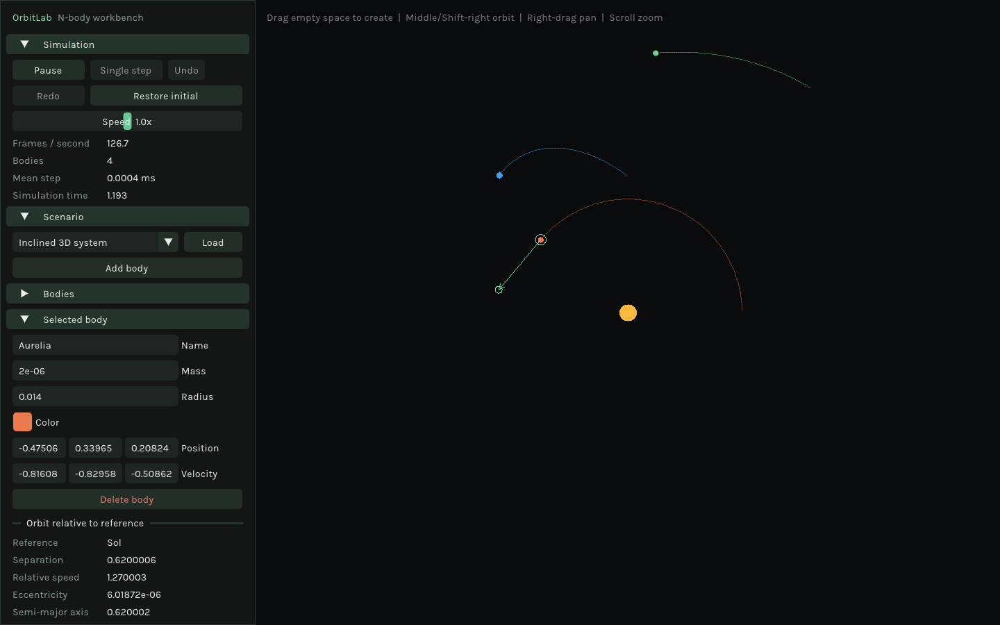
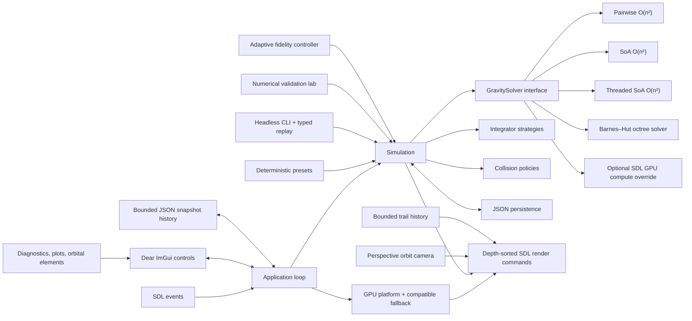

# OrbitLab

[](https://github.com/nicktperez/OrbitLab/actions/workflows/ci.yml)
[](LICENSE)

OrbitLab is a portable C++20 desktop application for constructing and observing
three-dimensional N-body gravitational systems. It combines multiple numerical integrators
and gravity solvers, collision models, JSON persistence, numerical diagnostics, and a
native SDL 3 + Dear ImGui interface.

The project is intentionally structured as an engineering sample rather than a visual-only
simulation. Physics has no dependency on SDL or ImGui, algorithms are selected through
narrow interfaces, deterministic behavior is tested, and a standalone performance harness
compares exact, data-oriented, threaded, and approximate force evaluation.

## Why OrbitLab exists

OrbitLab started with a simple question: how far can a small, understandable C++ application
be pushed without turning into a collection of disconnected demos?

Gravity makes that question unusually productive. A credible simulator needs numerical
integration, spatial algorithms, data-oriented and concurrent execution, deterministic
testing, persistence, profiling, native rendering, and careful resource ownership. OrbitLab
uses one coherent problem to explore those parts of modern C++20 together. The goal is not
to claim that its physics is new; it is to show the curiosity to investigate established
methods, combine them thoughtfully, measure the results, preserve failed experiments, and
state clearly what the evidence does and does not support.

The experimental OrbitLab Adaptive Fidelity Method follows that philosophy. It is a
project-specific timestep heuristic built from established N-body ideas, with a documented
hypothesis and reproducible comparisons—not a claim of a newly proven physical law.



## Features

- Real-time 3D Newtonian gravity with velocity Verlet, symplectic Euler, RK4, and Yoshida 4
- Stable fixed-timestep loop decoupled from rendering, with opt-in experimental adaptive control
- Add, select, edit, and delete bodies
- Drag-to-create bodies with an immediately visible velocity vector
- Direct body dragging and draggable velocity-vector handles with undo/redo
- Editable name, mass, radius, color, XYZ position, and XYZ velocity
- Perspective orbit camera with pan, cursor-centered zoom, depth-aware picking, and reset
- Middle-drag and trackpad-friendly Shift-right-drag camera orbit controls
- Inertial, follow-selected, barycentric, and co-rotating reference frames
- Toggleable bounded trajectory trails
- Pause, resume, single-step, and logarithmic speed control
- Sun/Earth, Earth/Moon, binary-star, deterministic asteroid-field, and inclined 3D presets
- Versioned XYZ JSON save/load with transactional validation and 2D-file migration
- FPS, body count, simulation time, and mean step telemetry
- Live plots for energy drift, momentum, angular momentum, step time, and body count
- Selected-pair orbital elements: eccentricity, apsides, semi-major axis, and period
- Searchable body navigator, undo/redo, and initial-state restoration
- Paused-state trajectory prediction for the selected body
- Pairwise, structure-of-arrays, threaded SoA, and Barnes–Hut octree gravity solvers
- Persistent `std::jthread` worker pool with configurable concurrency and no per-step thread churn
- SDL GPU-backed rendering selected explicitly, with a compatible SDL renderer fallback
- Optional SDL GPU direct-gravity compute kernel with a startup CPU-reference check
- In-app local profiler with timing and Barnes–Hut RMS-error comparison
- Non-destructive four-integrator comparison with runtime and energy-drift results
- Numerical validation laboratory for convergence, energy drift, center-of-mass motion,
  time reversibility, and Barnes–Hut error
- OrbitLab Adaptive Fidelity Method: a dimensionally consistent experimental RK4
  timestep controller with a falsifiable fixed-vs-adaptive comparison
- Headless CLI with validation, batch stepping, canonical hashes, typed record/replay,
  solver comparison, and machine-readable numerical reports
- None, merge, elastic, absorb, and threshold-based fragmentation collision modes
- Bounded collision event log with event type, combined mass, and momentum error
- Catch2 tests, CTest integration, sanitizer/coverage/tidy presets, and JSON fuzzing
- Four-solver benchmark harness over increasing body counts

## Build

### Requirements

- CMake 3.24 or newer
- A C++20 compiler
- Git and an internet connection for the first configure
- Platform development tools:
  - macOS: Xcode command-line tools
  - Linux: a compiler plus X11/Wayland development packages required by SDL
  - Windows: Visual Studio 2022 or a compatible C++20 toolchain

SDL 3, Dear ImGui, nlohmann/json, and Catch2 are pinned and acquired with CMake
`FetchContent`. No global copies of these libraries are required.

The repository also provides named CMake presets:

```sh
cmake --list-presets
cmake --preset debug
cmake --build --preset debug --parallel
ctest --preset debug
```

`asan-ubsan`, `tsan`, `coverage`, `clang-tidy`, `headless-ci`, and `fuzz` make
the non-default quality gates discoverable without memorizing compiler flags.

```sh
cmake -S . -B build -DCMAKE_BUILD_TYPE=Release
cmake --build build --parallel
ctest --test-dir build --output-on-failure
```

Run the application:

```sh
./build/OrbitLab
```

Multi-configuration generators such as Visual Studio place the executable under a
configuration directory; use `build/Release/OrbitLab.exe`.

Core-only builds are useful on headless machines:

```sh
cmake -S . -B build-headless \
  -DORBITLAB_BUILD_APP=OFF \
  -DORBITLAB_BUILD_TESTS=ON
cmake --build build-headless --parallel
ctest --test-dir build-headless --output-on-failure
```

## Headless workflows

`orbitlab_cli` exercises the same persistence and physics library as the desktop
application:

```sh
./build/orbitlab_cli validate scenario.json
./build/orbitlab_cli run scenario.json --steps 10000 --output final.json
./build/orbitlab_cli record scenario.json --steps 10000 --output experiment.orbit
./build/orbitlab_cli replay experiment.orbit --output reproduced.json
./build/orbitlab_cli hash reproduced.json
./build/orbitlab_cli compare scenario.json
./build/orbitlab_cli validate-numerics --output validation-report.json
./build/orbitlab_cli validate-method --output method-report.json
```

Replay files store the validated initial simulation and a bounded stream of typed
commands rather than opaque input events. A canonical FNV-1a state hash makes regression
results easy to compare in CI while keeping the on-disk JSON inspectable.

The [OrbitLab Adaptive Fidelity Method](docs/ORBITLAB_METHOD.md) combines
acceleration, finite-difference jerk, and closing-encounter timescales into a
deterministic dyadic RK4 timestep. Its documentation includes the equation,
dimensional analysis, unchanged pass/fail hypothesis, first failed Verlet experiment,
validated domain, and claims that remain unproven.

## Controls

| Action | Control |
|---|---|
| Pause or resume | `Space` or the transport button |
| Single simulation step | `.` while paused |
| Orbit camera | Middle-drag or `Shift` + right-drag |
| Pan camera | Right-drag the canvas |
| Move body | Left-drag a body in its screen-parallel 3D plane; velocity is preserved |
| Change velocity | Drag the selected body's green velocity handle |
| Create body with velocity | Drag from empty canvas; direction and length set velocity |
| Zoom at cursor | Mouse wheel |
| Reset camera | `R` or **Reset camera** |
| Select body | Left-click a body |
| Undo or redo | `Cmd/Ctrl+Z`, `Shift+Cmd/Ctrl+Z`, or panel buttons |
| Add body | **Add body**; the new body appears at the camera center |
| Save or load | Enter a JSON path, then choose **Save JSON** or **Load JSON** |

The default units are normalized: the Sun has mass 1, the Earth-Sun separation is 1,
and the gravitational constant is 1. This makes the model and presets easier to inspect
without concealing scale conversions in the UI.

Trajectory prediction is intentionally suspended above 512 bodies, and interactive solver
comparison is capped at 4,096 bodies, so exploratory tools cannot monopolize the UI thread.
The threaded SoA solver parallelizes independent target-body force evaluation through a
persistent RAII worker pool. Small ranges stay on the caller thread, where scheduling
would cost more than the work saved.

The SDL GPU renderer is selected explicitly and reports its active driver in the
Performance Lab. The optional compute gravity path currently ships an MSL kernel and is
enabled only when the active device accepts it and its startup result agrees with the CPU
direct solver. Other drivers retain the selected CPU solver and explain the unavailable
capability in the UI. Integration, collisions, and authoritative body state remain on the
CPU, making this a deliberately narrow and reviewable acceleration boundary.

## Architecture



`Simulation` owns bodies as value types and owns its active solver through
`std::unique_ptr<GravitySolver>`. The optional GPU implementation is injected through that
same interface, so the physics API does not depend on SDL. `GpuPlatform` owns the SDL
renderer and GPU device and releases them in reverse creation order; no owning raw pointers
cross that platform boundary. Persistence builds
a validated replacement state before mutating the running simulation, so a malformed file
cannot partially overwrite the current scene.

The default velocity Verlet integrator uses kick-drift-kick updates. Pairwise force
accumulation applies equal-and-opposite contributions in the same loop, reducing work and
keeping momentum behavior symmetric. The SoA variants instead copy hot position/mass fields
into contiguous arrays; their per-target loop is friendly to compiler auto-vectorization,
and the threaded variant partitions targets into disjoint output ranges. These are explicit,
benchmarkable alternatives—not hidden optimizations that complicate the baseline solver.

All physical state uses `Vec3`; `Vec2` is retained only for screen-space input and drawing.
The Barnes–Hut implementation partitions space with an octree, and the SoA paths carry
contiguous X, Y, and Z channels. Perspective projection, depth sorting, picking rays, and
screen-parallel drag planes remain in the application layer, so the physics core still has
no SDL dependency.

Reference frames belong to the camera/application layer and do not alter physical state.
Integrator and solver selection belong to `Simulation`, while render trails, predicted
paths, and plots are bounded UI-side histories. That separation keeps saved state portable
and numerical tests independent of a windowing system.

## Tests and performance harness

```sh
ctest --test-dir build --output-on-failure
./build/orbitlab_benchmark
```

Tests cover:

- 2D screen-vector and 3D spatial-vector arithmetic
- pairwise gravitational acceleration and force symmetry, including the Z axis
- agreement between pairwise, SoA, and threaded SoA acceleration
- Barnes–Hut octree approximation accuracy and coincident-position safety
- inertial behavior and bounded orbits across all four integrators
- deterministic ten-period orbital stability
- merge, absorb, elastic, and fragmentation collision behavior
- 3D JSON round trips, version-1 planar migration, and invalid-file isolation
- history branching, undo/redo, and initial restoration
- system energy, momentum, and angular momentum
- orbital-element derivation, perspective projection, orbit controls, and drag-plane transforms
- rejection of unsafe numeric input

The benchmark prints local mean force-evaluation times for 16–1,024 bodies. Results are deliberately not
committed as performance claims because they depend on compiler, build type, hardware, and
system load.

The numerical validation report uses deterministic inputs and explicit thresholds. It
compares all integrators across decreasing timesteps against a high-resolution reference,
measures energy and center-of-mass drift, checks time reversibility, and samples
Barnes–Hut RMS acceleration error at multiple opening angles.

## Repository map

```text
include/orbitlab/   Public physics and persistence API
src/core/           Platform-independent implementation
src/app/            SDL, rendering, camera, and ImGui concerns
src/cli/            Headless batch, replay, hashing, and validation commands
tests/              Catch2 unit and deterministic stability tests
benchmarks/         Comparative gravity-solver scaling harness
fuzz/               libFuzzer persistence target and seed corpus
.github/workflows/  macOS, Linux, and Windows build/test matrix
```

## Roadmap

Completed:

- Four interchangeable gravity solvers, including Barnes–Hut and threaded SoA
- Full XYZ physics state, 3D collisions, and Barnes–Hut octree acceleration
- Perspective orbit camera, depth-sorted rendering, depth-aware picking, and 3D drag planes
- Version-3 persistence with backward-compatible 2D migration, adaptive settings,
  and an inclined-system preset
- Four integrators with fixed-step stability coverage and a validated adaptive RK4 domain
- Editing, presets, trails, camera controls, transport controls
- Five collision modes, JSON persistence, and live telemetry
- Velocity handles, trajectory prediction, hover feedback, and body search
- Drag-to-create, reference frames, and orbital-element analysis
- Undo/redo, initial restoration, diagnostics, and collision event history
- Historical diagnostic plots and an in-app solver profiler
- Automated unit tests, performance harness, and CI configuration
- Sanitizer, coverage, clang-tidy, and fuzzing presets with dedicated CI jobs
- Headless deterministic batch execution, typed replay, and canonical state hashes
- Persistent worker-thread job system and scaling benchmark coverage
- Deterministic numerical-validation reports in both CLI and desktop UI
- Experimental adaptive-fidelity equation, deterministic experiment, and falsification record
- Explicit SDL GPU render transport with a compatibility fallback
- Capability-gated MSL gravity compute kernel with CPU-reference startup validation

Future ideas:

- Native file picker abstraction
- Optional physical-unit display and unit conversion
- Side-by-side synchronized integrator comparison
- Interactive replay timeline and richer preset authoring
- Precompiled SPIR-V and DXIL compute shaders generated through SDL_shadercross
- Native SDL GPU sphere/mesh pipeline with depth buffering and instanced rendering
- Asynchronous GPU readback and fully GPU-resident integration for large systems
- Statistical OAFM validation across generated scenario families and comparison with
  established embedded Runge–Kutta controllers

Platform claims should be based on CI results and hands-on runs. The workflow is configured
for macOS, Ubuntu, and Windows; this README does not claim all three are verified until those
jobs have run successfully.

## License

OrbitLab is available under the [MIT License](LICENSE).
